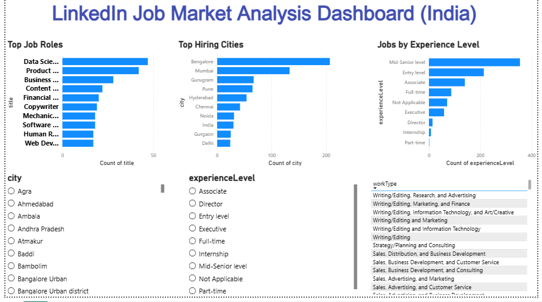

# 🚀 LinkedIn Job Market Analysis Dashboard (India)

## 📊 Project Overview
This project focuses on analyzing LinkedIn job postings data to understand current hiring trends across India. It provides insights into the most in-demand job roles, top hiring cities, and experience-level requirements. The goal is to transform raw job data into meaningful insights that can help job seekers understand the market better.

## 🛠 Tools & Skills Used
- Excel (Data Cleaning & Preparation)
- Power BI (Data Visualization & Dashboard Creation)
- Data Storytelling (Presenting insights through visuals)
- Analytical Thinking (Identifying patterns and trends)

## 📸 Dashboard Preview

## 🔗 Live Dashboard
[Click here to view the interactive Power BI dashboard](https://app.powerbi.com/links/Tf_4nr1Mum?ctid=e93d71d6-b5c0-4b78-a861-d9964ecdfcd6&pbi_source=linkShare)

## 🔍 Key Business Insights

| Focus Area           | Insights                                                                 |
|---------------------|-------------------------------------------------------------------------|
| Location Trends     | Hiring is highly concentrated in metro cities like Bangalore, Mumbai, and Delhi |
| Experience Demand   | Mid-level roles dominate the job market, showing preference for experienced candidates |
| Job Roles           | Data Analyst and related roles are among the most in-demand positions   |
| Regional Variation  | Job opportunities are unevenly distributed across different cities      |

- ## 📌 Project Tasks
- Collected and selected relevant job dataset
- Cleaned and standardized data using Excel
- Prepared data for analysis
- Built interactive dashboard in Power BI
- Created visualizations for job trends and insights
- Applied filters and slicers for better user interaction
- Analyzed data and derived key insights

## 📦 Deliverables
- Power BI Dashboard (.pbix)
- Cleaned Dataset (.csv)
- Dashboard Screenshot (PNG)
- GitHub Repository with documentation

## 🚀 Conclusion
This project demonstrates how data analytics can be used to extract meaningful insights from real-world job data. The dashboard provides a clear view of hiring trends, helping understand demand across roles, locations, and experience levels. It reflects practical skills in data cleaning, visualization, and insight generation.

## 👩‍💻 About Me

Trishasree Dewan  
- Aspiring Data Analyst | 3rd Year B.Tech (Electrical Engineering),NIT Agartala 
- Focused on Data Analytics & Visualization  
- Skilled in Excel, SQL, Power BI, and Python  

🔗 LinkedIn: https://www.linkedin.com/in/trishasree-dewan-53681929a  
🔗 GitHub: https://github.com/dewantrishasree17-dev

## 📜 License

This repository and its contents are intended for educational and portfolio purposes only.  
All datasets and simulations used are for learning purposes only.  
No commercial use is allowed.
